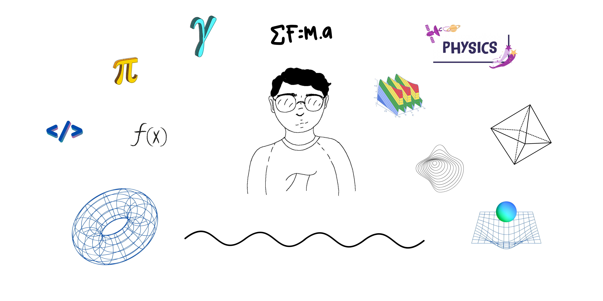

  

<h1 align="center">Hi 👋, I'm Peter Argueta</h1>
<h3 align="center">I have a degree in physics and work in climate data analysis.</h3>

<h3 align="left">Connect with me:</h3>

<h3 align="left">Languages and Tools:</h3>

   

